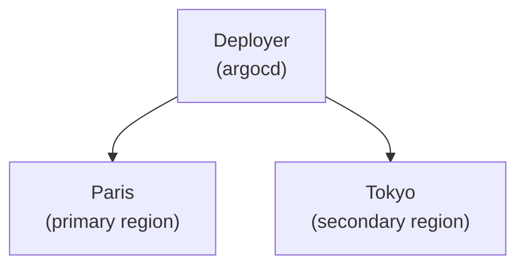

# ApplicationSet PoC

## Objective

The ApplicationSet controller, developed by Argo, offers a powerful solution for deploying applications across multiple regions. In this proof of concept, we explore the controller's relevance in deploying an application across two separate regions. A key constraint we consider is that the application is resource-intensive, allowing only one replica per region. This constraint necessitates careful coordination to ensure that updates are performed sequentially, region by region.

## Setup

### Architecture

The Poc qill consist of three kubernetes clusters, the first nammed `deployer` will host an ArgoCD instance with access granted for the two other cluters nammed `Paris` and `Tokyo`.

A dummy gretting webserver will be deployed on both regions and expected result is to be able to curl them and have a different response depending of the called region.

This setup requires a single Linux laptop, as the clusters will be created and managed as Docker containers using kind. It's important to note that each container will have port 30000 exposed to the host. For the Deployer this will be used to give access to ArgoCD API and for the two others it will expose a dummy http server.

### Requirements

- either Docker or Podman
- kind
- helm
- argocd
- kubectx

## Instructions

You need to be in the workspace of this project as some command require files that are part of the project.

### Bootstrap the clusters

```bash
kind create cluster --config clusters/deployer.yaml
kind create cluster --config clusters/paris.yaml
kind create cluster --config clusters/tokyo.yaml
```
3 containers should be running and with 30000 port exposed.
```bash
> docker ps
CONTAINER ID   IMAGE                  COMMAND                  CREATED        STATUS        PORTS                                                NAMES
b584f5b21b18   kindest/node:v1.27.3   "/usr/local/bin/entr…"   2 hours ago   Up 2 hours   127.0.0.1:33573->6443/tcp, 0.0.0.0:8002->30000/tcp   tokyo-control-plane
75a0942eead1   kindest/node:v1.27.3   "/usr/local/bin/entr…"   2 hours ago   Up 2 hours   127.0.0.1:34721->6443/tcp, 0.0.0.0:8001->30000/tcp   paris-control-plane
6fa59cd1308a   kindest/node:v1.27.3   "/usr/local/bin/entr…"   2 hours ago   Up 2 hours   127.0.0.1:46573->6443/tcp, 0.0.0.0:8000->30000/tcp   deployer-control-plane
```

### Install ArgoCD

```bash

# Switch to deployer cluster
kubectx kind-deployer

# Create namespace
kubectl create ns argocd

# Use helm to install ArgoCD
helm repo add argo-helm https://argoproj.github.io/argo-helm
helm upgrade --install argocd argo-helm/argo-cd --values argocd.yml --namespace argocd

# Login to argocd with the CLI
ROOT_PASSWORD=$(k get secrets -n argocd argocd-initial-admin-secret -o jsonpath={.data.password} | base64 --decode)
argocd  login --username admin --password "$ROOT_PASSWORD" 127.0.0.1:8000

```

### Connect regionnal clusters to ArgoCD

```bash
# Give ArgoCD access to other clusters
source setup_cluster.sh
setup_cluster "paris"
setup_cluster "tokyo"
```
Verify the clusters are well added in ArgoCD
```bash
> argocd cluster list
SERVER                          NAME                    VERSION  STATUS      MESSAGE                                                  PROJECT
https://172.19.0.3:6443         kubernetes-admin@paris  1.27     Successful
https://172.19.0.4:6443         kubernetes-admin@tokyo  1.27     Successful
https://kubernetes.default.svc  in-cluster                       Unknown     Cluster has no applications and is not being monitored.
```

todo: merge cluster creation
